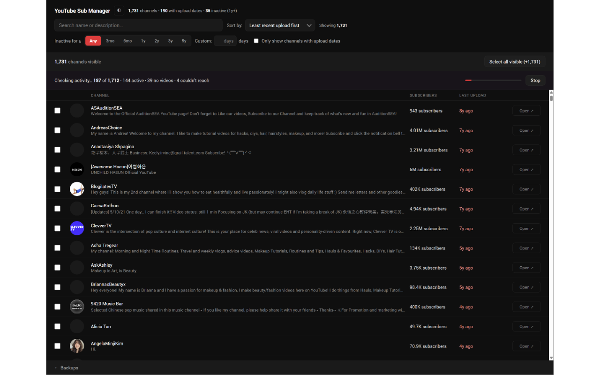
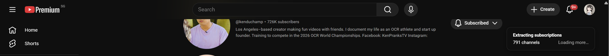
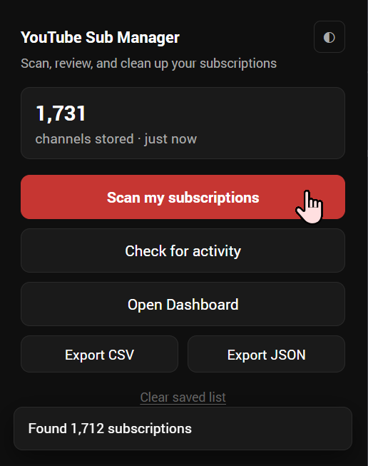
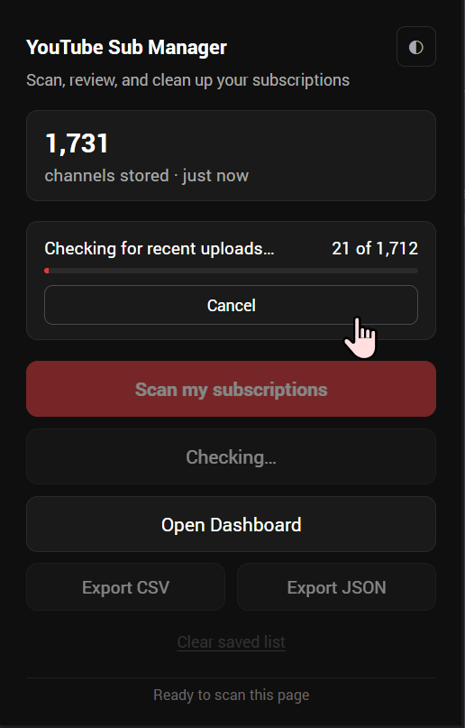
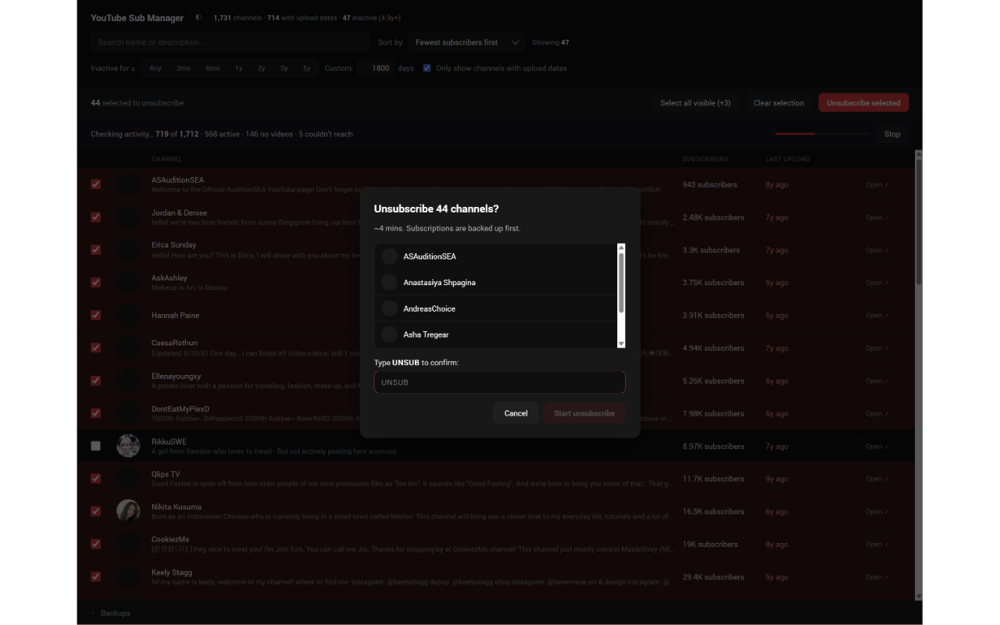

# YouTube Sub Manager

[](./LICENSE)

Chrome extension to find and clean up stale YouTube subscriptions. No API keys, no OAuth -- everything runs locally in your browser.



## How It Works

1. **Scan** -- visit your subscriptions page and the extension collects every channel
2. **Review** -- sort and filter by last upload date to find inactive channels
3. **Clean up** -- bulk unsubscribe with safety confirmations and automatic backups

## Features

- **Scan** all your YouTube subscriptions in one click
- **Check activity** -- see when each channel last uploaded a video
- **Sort and filter** by last upload date, name, or subscriber count with staleness presets
- **Bulk unsubscribe** with safety confirmations and automatic backups
- **Export** your full subscription list as CSV or JSON
- **100% local** -- your data never leaves your browser

<details>
<summary>More screenshots</summary>

### Scan your subscriptions


### Popup controls


### Enrichment progress


### Unsubscribe confirmation


</details>

## Install from Source

Requires [Node.js](https://nodejs.org/) 18+ and [pnpm](https://pnpm.io/) 9+.

1. Clone this repo and install dependencies:
   ```bash
   git clone https://github.com/germainelry/youtube-sub-manager.git
   cd youtube-sub-manager
   pnpm install
   ```
2. Build the extension:
   ```bash
   pnpm build
   ```
3. Open `chrome://extensions` in Chrome
4. Enable **Developer mode** (top-right toggle)
5. Click **Load unpacked** and select the `dist/` folder
6. Pin the extension to your toolbar
7. Go to [youtube.com/feed/channels](https://www.youtube.com/feed/channels) and click **Scan my subscriptions**

The first time you scan, Chrome will prompt you to grant access to youtube.com.

**Open your [subscriptions page](https://www.youtube.com/feed/channels) and click Scan to get started.**

## Development

Built with TypeScript, React 18, Vite, Dexie (IndexedDB), and Chrome Manifest V3.

```
pnpm dev       # Dev server with hot reload
pnpm build     # Production build
pnpm test      # Run tests
pnpm lint      # Lint
pnpm format    # Format
```

See [CONTRIBUTING.md](./CONTRIBUTING.md) for dev setup, branch conventions, and code style.

## Privacy

YouTube Sub Manager stores all data locally in your browser. No analytics, no telemetry, no external servers. See [PRIVACY_POLICY.md](./PRIVACY_POLICY.md) for details.

## License

[MIT](./LICENSE)
